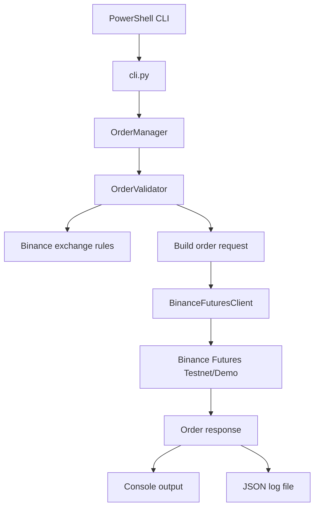
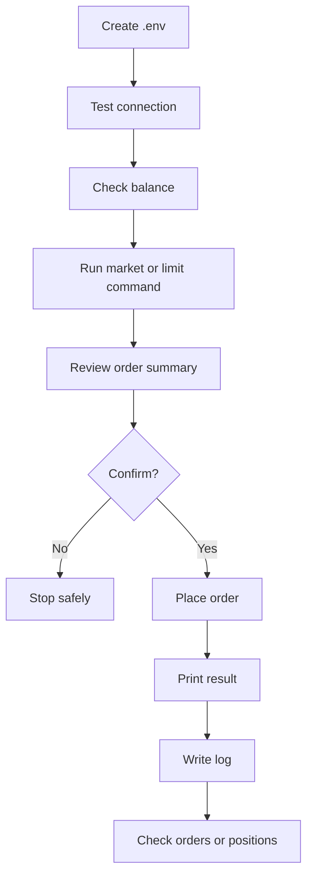
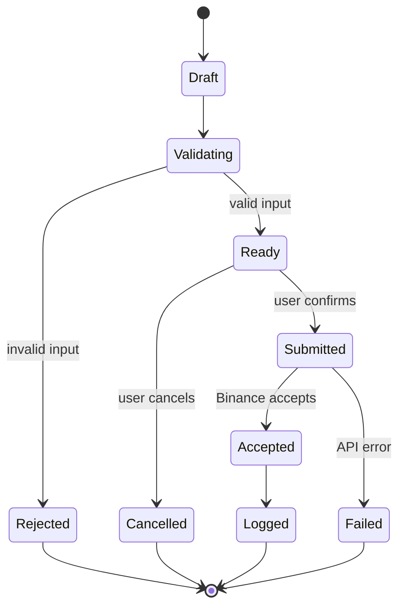

# Binance Futures Testnet Trading Bot

A Python CLI trading bot for Binance USD-M Futures testnet/demo. It places MARKET and LIMIT orders, validates user input, logs requests/responses, and keeps Binance API access separated from CLI code.

## Highlights

- MARKET and LIMIT orders
- BUY and SELL support
- Bonus STOP-LIMIT order type
- Confirmation prompts and `--yes` automation
- JSON log files for order requests, responses, and errors
- Commands for balance, price, open orders, order status, cancellation, positions, and position closing
- Unit tests with fake Binance clients, so tests run without real API keys

## Project Structure

```text
trading_bot/
  bot/
    __init__.py
    client.py          # Binance Futures API wrapper
    orders.py          # Order placement, retry, response parsing
    validators.py      # Input and exchange-rule validation
    logging_config.py  # Console and JSON logging
  tests/
    test_orders.py
  cli.py               # Typer CLI entry point
  .env.example
  .gitignore
  README.md
  requirements.txt
```

## Architecture



## User Flow



## Order State Flow



## Setup

Use PowerShell from the project folder:

```powershell
cd C:\Users\vish9\Downloads\trading_bot_project_full\trading_bot
```

This machine uses `uv` to provide Python:

```powershell
uv run --with-requirements requirements.txt python cli.py --help
```

Create local credentials file:

```powershell
Copy-Item .env.example .env
```

Fill `.env`:

```env
BINANCE_API_KEY=your_testnet_or_demo_key
BINANCE_API_SECRET=your_testnet_or_demo_secret
BINANCE_USE_DEMO_URL=true
LOG_LEVEL=INFO
LOG_FILE=logs/trading_bot.log
```

Never commit `.env`.

## Binance Key Notes

Use a Futures testnet/demo key, not a normal Spot/Mainnet key.

Current Binance Futures demo keys use:

```text
https://demo-fapi.binance.com
```

The assignment mentions:

```text
https://testnet.binancefuture.com
```

The app supports both endpoints:

- `BINANCE_USE_DEMO_URL=true` for current Binance Demo/Futures keys
- `BINANCE_USE_DEMO_URL=false` for legacy `testnet.binancefuture.com` keys

If you see `API Error (code=-2015)`, check that the key is a Futures demo/testnet key, API trading is enabled, IP restrictions allow your IP, and the secret is pasted correctly.

## Core Commands

Check signed connectivity:

```powershell
uv run --with-requirements requirements.txt python cli.py test-connection
```

Show balance:

```powershell
uv run --with-requirements requirements.txt python cli.py balance
```

Place a MARKET order:

```powershell
uv run --with-requirements requirements.txt python cli.py market --symbol BTCUSDT --side BUY --quantity 0.001
```

Place a LIMIT order:

```powershell
uv run --with-requirements requirements.txt python cli.py limit --symbol BTCUSDT --side SELL --quantity 0.001 --price 120000
```

Skip confirmation:

```powershell
uv run --with-requirements requirements.txt python cli.py market --symbol BTCUSDT --side BUY --quantity 0.001 --yes
```

## Bonus Order

STOP-LIMIT:

```powershell
uv run --with-requirements requirements.txt python cli.py stop-limit --symbol BTCUSDT --side SELL --quantity 0.001 --price 109000 --stop-price 110000
```

## Utility Commands

```powershell
# Current mark price
uv run --with-requirements requirements.txt python cli.py price --symbol BTCUSDT

# Set leverage
uv run --with-requirements requirements.txt python cli.py set-leverage --symbol BTCUSDT --leverage 5

# Show open orders
uv run --with-requirements requirements.txt python cli.py open-orders --symbol BTCUSDT

# Check one order
uv run --with-requirements requirements.txt python cli.py order-status --symbol BTCUSDT --order-id 123456789

# Cancel one open order
uv run --with-requirements requirements.txt python cli.py cancel-order --symbol BTCUSDT --order-id 123456789

# Show open positions
uv run --with-requirements requirements.txt python cli.py positions

# Close an open position with a reduce-only market order
uv run --with-requirements requirements.txt python cli.py close-position --symbol BTCUSDT
```

## Logs

Logs are ignored by Git because they may contain account or order details.

Default log:

```text
logs/trading_bot.log
```

Generate evaluator logs locally:

```powershell
uv run --with-requirements requirements.txt python cli.py market --symbol BTCUSDT --side BUY --quantity 0.001 --yes --log-file logs/market_order.log
uv run --with-requirements requirements.txt python cli.py limit --symbol BTCUSDT --side SELL --quantity 0.001 --price 120000 --yes --log-file logs/limit_order.log
```

For public GitHub submission, keep logs ignored. If logs are required, attach sanitized copies separately or submit them in a private zip.

Example log entry:

```json
{
  "timestamp": "2026-06-12T10:30:00+00:00",
  "level": "INFO",
  "logger": "trading_bot.orders",
  "message": "Order accepted by Binance",
  "symbol": "BTCUSDT",
  "side": "BUY",
  "order_type": "MARKET",
  "order_id": 123456789
}
```

## Tests

```powershell
uv run --with-requirements requirements.txt python -m unittest discover -s tests
```

The tests use fake Binance clients and cover:

- LIMIT order requires price
- quantity formatting by `LOT_SIZE.stepSize`
- price formatting by `PRICE_FILTER.tickSize`
- MARKET order uses `newOrderRespType=RESULT`
- STOP-LIMIT maps to Binance type `STOP`

## Cleanup After Testing

Check account state:

```powershell
uv run --with-requirements requirements.txt python cli.py open-orders --symbol BTCUSDT
uv run --with-requirements requirements.txt python cli.py positions
```

Cancel open order:

```powershell
uv run --with-requirements requirements.txt python cli.py cancel-order --symbol BTCUSDT --order-id 123456789
```

Close open position:

```powershell
uv run --with-requirements requirements.txt python cli.py close-position --symbol BTCUSDT --yes
```

## GitHub Submission

```powershell
git init
git add .
git status
git commit -m "Build Binance Futures testnet trading bot"
git remote add origin https://github.com/YOUR_USERNAME/YOUR_REPO_NAME.git
git branch -M main
git push -u origin main
```

Before committing, make sure `.env` and `logs/` are not staged.

## Assumptions

- The app is for Binance USD-M Futures testnet/demo only.
- Mainnet trading is intentionally not used.
- `BINANCE_USE_DEMO_URL=true` is the expected setting for current Binance demo keys.
- Logs are generated locally and ignored by default.
