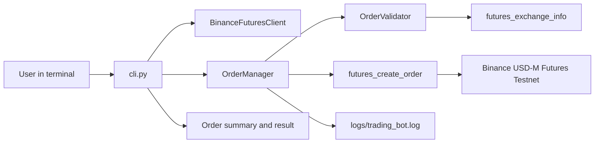
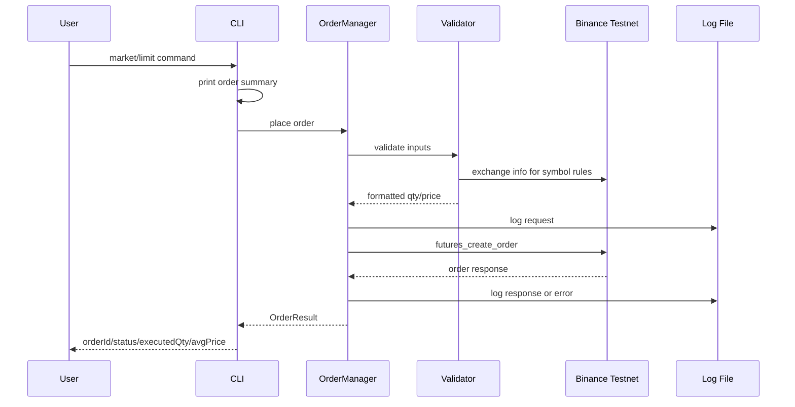

# Binance Futures Testnet Trading Bot

A small Python CLI app for placing Binance USD-M Futures testnet orders with a clean client layer, order layer, validation, structured logging, and tests.

## What This Project Covers

- MARKET orders
- LIMIT orders
- BUY and SELL sides
- CLI input validation with clear error messages
- JSON log file for API requests, responses, retries, and failures
- Clean module split: client, validator, order manager, CLI
- Bonus: enhanced CLI UX with Typer confirmations and `--yes`
- Extra bonus code: STOP-LIMIT support using Binance `STOP` order type

## Project Structure

```text
trading_bot/
  bot/
    __init__.py
    client.py          # Binance Futures API setup and account helpers
    orders.py          # MARKET, LIMIT, STOP_LIMIT placement flow
    validators.py      # CLI/API input validation and exchange precision rules
    logging_config.py  # JSON file logs plus readable console logs
  tests/
    test_orders.py     # Unit tests with a fake Binance client
  cli.py               # Typer CLI entry point
  .env.example
  .gitignore
  README.md
  requirements.txt
```

## How The App Works



Request lifecycle:



## Setup

### 1. Create Binance Futures testnet credentials

Use the assignment URL:

```text
https://testnet.binancefuture.com
```

Create API credentials from the Futures Testnet account. Keep the secret private.

Important: a normal Binance account API key or Spot API key is not enough. This bot calls signed USD-M Futures endpoints such as account balance and order placement. If the key is not a Futures Testnet key, or Futures/API trading permissions are not enabled, Binance returns:

```text
API Error (code=-2015): Invalid API-key, IP, or permissions for action
```

If you see that error, check:

- The key was created from Futures Testnet, not normal Binance Spot/Mainnet.
- Futures trading/API permissions are enabled for the key.
- IP restrictions allow your current IP, or are disabled while testing.
- The API key and secret are pasted on separate `.env` lines:

```env
BINANCE_API_KEY=your_key_here
BINANCE_API_SECRET=your_secret_here
```

Binance's current USD-M Futures docs use:

```text
https://demo-fapi.binance.com
```

The code supports both endpoints. For the current Binance Demo/Futures keys used during testing, keep `BINANCE_USE_DEMO_URL=true`. Use `false` only if your evaluator gives you legacy `testnet.binancefuture.com` keys.

### 2. Run with uv

On this PC, `python` is not available directly in PowerShell, but `uv` is available and can provide Python automatically.

```powershell
cd C:\Users\vish9\Downloads\trading_bot_project_full\trading_bot
uv run --with-requirements requirements.txt python cli.py --help
```

Optional: if you specifically want a local `.venv`, create it with `uv` instead of `python`:

```powershell
uv venv .venv
.\.venv\Scripts\Activate.ps1
uv pip install -r requirements.txt
python cli.py --help
```

### 3. Configure environment variables

```powershell
Copy-Item .env.example .env
```

Edit `.env`:

```env
BINANCE_API_KEY=your_testnet_api_key_here
BINANCE_API_SECRET=your_testnet_api_secret_here
BINANCE_USE_DEMO_URL=true
LOG_LEVEL=INFO
LOG_FILE=logs/trading_bot.log
```

Never commit `.env`. It is ignored by `.gitignore`.

## Commands

Check the CLI:

```powershell
uv run --with-requirements requirements.txt python cli.py --help
```

Test credentials and Futures endpoint:

```powershell
uv run --with-requirements requirements.txt python cli.py test-connection
```

Place a MARKET order:

```powershell
uv run --with-requirements requirements.txt python cli.py market --symbol BTCUSDT --side BUY --quantity 0.001
```

Place a LIMIT order:

```powershell
uv run --with-requirements requirements.txt python cli.py limit --symbol BTCUSDT --side SELL --quantity 0.001 --price 120000
```

Skip the confirmation prompt for repeatable test runs:

```powershell
uv run --with-requirements requirements.txt python cli.py market --symbol BTCUSDT --side BUY --quantity 0.001 --yes
```

Bonus STOP-LIMIT example:

```powershell
uv run --with-requirements requirements.txt python cli.py stop-limit --symbol BTCUSDT --side SELL --quantity 0.001 --price 109000 --stop-price 110000
```

Useful helpers:

```powershell
uv run --with-requirements requirements.txt python cli.py price --symbol BTCUSDT
uv run --with-requirements requirements.txt python cli.py balance
uv run --with-requirements requirements.txt python cli.py set-leverage --symbol BTCUSDT --leverage 5
uv run --with-requirements requirements.txt python cli.py open-orders --symbol BTCUSDT
uv run --with-requirements requirements.txt python cli.py order-status --symbol BTCUSDT --order-id 123456789
uv run --with-requirements requirements.txt python cli.py cancel-order --symbol BTCUSDT --order-id 123456789
uv run --with-requirements requirements.txt python cli.py positions
uv run --with-requirements requirements.txt python cli.py close-position --symbol BTCUSDT
```

## Logs

The app writes JSON logs to:

```text
logs/trading_bot.log
```

Generated logs are ignored by Git so account/order details are not pushed to a public repository.

If the evaluator asks for log files, generate them locally with:

```powershell
uv run --with-requirements requirements.txt python cli.py market --symbol BTCUSDT --side BUY --quantity 0.001 --yes --log-file logs/market_order.log

uv run --with-requirements requirements.txt python cli.py limit --symbol BTCUSDT --side SELL --quantity 0.001 --price 120000 --yes --log-file logs/limit_order.log
```

`--log-file` can also be used before the command as a global option:

```powershell
uv run --with-requirements requirements.txt python cli.py --log-file logs/market_order.log market --symbol BTCUSDT --side BUY --quantity 0.001 --yes
```

For a public GitHub submission, keep logs ignored. If logs are required, attach sanitized copies separately or include them only in a private zip submission.

Example log shape:

```json
{
  "timestamp": "2026-06-12T10:30:00+00:00",
  "level": "INFO",
  "logger": "trading_bot.orders",
  "message": "Order accepted by Binance",
  "symbol": "BTCUSDT",
  "side": "BUY",
  "order_type": "MARKET",
  "order_id": 123456789
}
```

## Tests

The tests do not need real Binance credentials. They use a fake client to verify validation and order parameter mapping.

```powershell
uv run --with-requirements requirements.txt python -m unittest discover -s tests
```

Current tested behavior:

- LIMIT orders require price
- quantity is rounded down to Binance `LOT_SIZE.stepSize`
- price is rounded down to Binance `PRICE_FILTER.tickSize`
- STOP-LIMIT is sent to Binance as `type=STOP`

## Design Choices

- `client.py` owns credentials, testnet URL selection, and Futures health checks.
- `validators.py` catches common mistakes before an order is sent.
- `orders.py` has one reusable placement path, so all order types share retry, error handling, logging, and result formatting.
- `cli.py` is thin. It collects input, prints summaries, asks for confirmation, and displays results.
- `python-binance` is used because it is simple for a small assignment and supports Futures methods.

## Bonus Recommendation

For this assignment, the best bonus is option 2: enhanced CLI UX.

Reason: it directly improves the grader's experience. Confirmation prompts, clear summaries, `--yes`, and clean error messages make the app easier and safer to test. STOP-LIMIT is also implemented, but if the evaluator says "choose only one", present enhanced CLI UX as the main bonus.

## Assumptions

- This app is for Binance USD-M Futures testnet/demo only, not mainnet.
- The assignment mentions `https://testnet.binancefuture.com`; current Binance Demo/Futures keys use `https://demo-fapi.binance.com`.
- Set `BINANCE_USE_DEMO_URL=true` for current Binance Demo/Futures keys.
- MARKET order average price may be returned as `avgPrice` or may stay `0` depending on Binance response type and timing.
- No real orders can be verified without valid testnet credentials.
